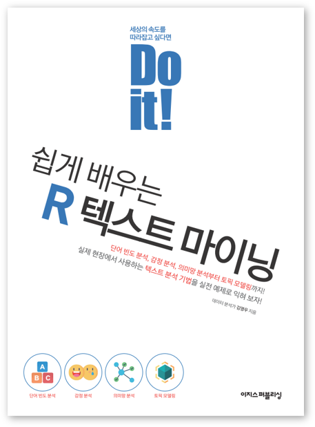

# <Do it! 쉽게 배우는 R 텍스트 마이닝> 저장소

---

폴더           | 내용
:------------- |:-------------
[Data](https://github.com/youngwoos/Doit_textmining/blob/main/Data) | 실습 데이터 파일
[Script](https://github.com/youngwoos/Doit_textmining/blob/main/Script) | 본문 R 스크립트
[Quiz](https://github.com/youngwoos/Doit_textmining/blob/main/Quiz) | 분석 도전 정답 스크립트
[Lecture](https://github.com/youngwoos/Doit_textmining/blob/main/Lecture) | 강의용 프리젠테이션 자료

---

## 질문하기
궁금한 점이 있으면 페이스북 [데이터 분석 커뮤니티](https://www.facebook.com/groups/datacommunity)에 질문을 올려 주세요. 데이터 분석을 공부하는 사람들과 질문과 답변을 주고받으며 함께 공부할 수 있습니다.  질문할 때 작성한 코드나 캡처 이미지를 함께 올려 주시면 답변하는 데 도움이 됩니다.

## 기타 문의
다른 문의 사항은 stats7445@gmail.com으로 메일을 보내주세요.
